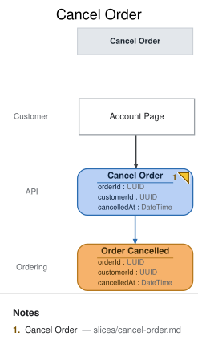

# Slice: Cancel Order

## Intent
Customers have been phoning support to cancel orders they placed by mistake or no longer want.
This slice lets them self-serve: a customer cancels their own order from the **Account Page**,
the same screen `Order Status` already renders on. This is the walkthrough's CHANGE beat — a
real, small change request modeled as an added slice, not a code-first patch — and it reopens the
cancellation question `domain-decisions.md` deliberately deferred out of the base six-slice model.

## Trigger & Actor
The **Customer**, from the **Account Page**, cancels an order they placed. Only the customer who
placed the order may cancel it — see **Non-Functional Requirements**. Each cancel click issues one
`Cancel Order` command carrying the order's own `orderId`.

## Command / Input
**Command:** `Cancel Order`

| Field | Type | Required | Rules / Validation |
|-------|------|----------|--------------------|
| orderId | UUID | yes | Must name an order with a recorded `Order Placed` event. Unknown `orderId` is rejected — there is nothing to cancel. |
| customerId | UUID | yes | Must match the `customerId` on that order's `Order Placed` event — see the authz note under Non-Functional Requirements. |
| cancelledAt | DateTime | no | **Modeling note, not a real request field:** this is the server clock's timestamp at command-handling time, not something the client sends. It appears on the command element only so the DSL's event-field/command-field completeness check can trace `Order Cancelled.cancelledAt` to a same-slice origin — the same convention `place-order.md` documents for `placedAt` (see `domain-decisions.md`'s timestamp-origin convention). The actual API request body excludes it. |

## Trigger
**Triggered by:** screen `Account Page` @Customer

## Event(s) Emitted
**Event:** `Order Cancelled` → context `Ordering`
**Read by:** `Open Orders — cancelled` view (this branch's `slices/open-orders-cancelled.md`,
the repeated `Open Orders` instance).

| Field | Type | Immutable Fact? | Source / Notes |
|-------|------|-----------------|----------------|
| orderId | UUID | yes | Copied from the command; identifies the order being cancelled. |
| customerId | UUID | yes | Copied from the command, after authz has confirmed it matches the order's owner. |
| cancelledAt | DateTime | yes | Server clock at the moment the event is recorded — the actual, meaningful origin of this field (see the Command/Input note above on why it's echoed there too). |

## Invariants / Business Rules
- **INV-CO-1 (v2): an order can be cancelled before `Payment Captured` exists for it, or within
  the 24-hour grace window after capture.**
  - The payment provider auto-voids captures inside its settlement window, so a cancel within
    24h of `capturedAt` needs no refund flow; beyond that window, `Cancel Order` is **rejected**
    — money has genuinely moved, and post-settlement cancellation belongs to a separate
    (unmodeled, future) refund/return path, not this command.
  - *(v1 said "only BEFORE capture, ever"; the grace window shipped in
    [PR #17](https://github.com/milehimikey/meridian-goods/pull/17) ahead of this doc — the
    2026-08-23 conformance run caught the drift and the ratifier ruled the behavior intentional.
    See `## Delta` and `conformance/2026-08-23-report.md`.)*
- **INV-CO-2 (idempotent cancel):** A `Cancel Order` command for an `orderId` that already has an
  `Order Cancelled` event recorded is a **no-op**: no second event is appended, and the command
  returns the original cancellation's result (its original `cancelledAt` stands, never overwritten
  by a later duplicate click's timestamp).
  - Design call: cancellation is a one-way action a customer is asking for, not a payload the
    tool needs to compare for conflict (unlike `Place Order`'s INV-PO-1, there's no meaningfully
    different "conflicting" cancel payload to reject) — the second and any later `Cancel Order`
    for an already-cancelled order is always a harmless retry, so it is always treated as one
    rather than rejected.

## Scenarios (Given / When / Then)
- **Happy path**
  - **Given:** `Order Placed` exists for `orderId: O1` / `customerId: C1` and no
    `Payment Captured` has been recorded for `O1`
  - **When:** `C1` submits `Cancel Order` for `O1`
  - **Then:** `Order Cancelled` is recorded with `orderId: O1`, `customerId: C1`, and a
    server-assigned `cancelledAt`; `O1` disappears from (or is marked cancelled on) the
    `Open Orders` staff board via `Open Orders — cancelled`.
- **Cancel within the grace window (INV-CO-1 v2)**
  - **Given:** `Order Placed` exists for `orderId: O1` and `Payment Captured` was recorded for
    `O1` less than 24 hours ago
  - **When:** `C1` submits `Cancel Order` for `O1`
  - **Then:** `Order Cancelled` is recorded (the provider auto-voids the capture inside its
    settlement window).
- **Rejected — captured beyond the grace window (INV-CO-1 v2)**
  - **Given:** `Order Placed` exists for `orderId: O1` and `Payment Captured` was recorded for
    `O1` more than 24 hours ago
  - **When:** `C1` submits `Cancel Order` for `O1`
  - **Then:** the command is rejected as too-late-to-cancel and no `Order Cancelled` event is
    recorded.
- **Idempotent retry (INV-CO-2)**
  - **Given:** `Order Cancelled` already exists for `orderId: O1`
  - **When:** `C1` submits `Cancel Order` for `O1` again (double-click, retried request)
  - **Then:** no second `Order Cancelled` event is recorded and the command returns the
    original cancellation's result.
- **Rejected — wrong customer**
  - **Given:** `Order Placed` exists for `orderId: O1` / `customerId: C1`
  - **When:** a different customer `C2` submits `Cancel Order` for `O1`
  - **Then:** the command is rejected as unauthorized and no `Order Cancelled` event is
    recorded.
- **Rejected — unknown order**
  - **Given:** no `Order Placed` event exists for `orderId: O9`
  - **When:** `Cancel Order` is submitted for `O9`
  - **Then:** the command is rejected as unknown and no event is recorded.

## Delta

- **MODIFIED (v1 → v2, ratified 2026-08-23):** INV-CO-1 — "cancel only before `Payment Captured`"
  became "cancel before capture, or within the 24h post-capture grace window (provider auto-void
  settlement window)". Scenario "Rejected — already captured" split into the within-grace success
  and beyond-grace rejection scenarios above. Origin: shipped in PR #17 ahead of the model; caught
  by the 2026-08-23 conformance run; ratified as intentional (ruling recorded in
  `conformance/2026-08-23-report.md`). Implementation already conforms — no propagation work.

## Alternate & Error Flows
- **Race with capture:** if `Payment Captured` and `Cancel Order` are in flight at nearly the same
  time for the same order, INV-CO-1 is evaluated against whatever this command handler's
  consistency boundary has actually recorded at decision time — if `Payment Captured` lands first,
  the cancel is rejected (INV-CO-1); if `Cancel Order` decides first, capture is this model's
  concern to reject on its own side (out of scope for this slice's doc; see
  `slices/record-payment-result.md`).
- **Already-cancelled retry:** see INV-CO-2 — always a silent no-op, never a rejection, since a
  repeat cancel request carries no information that could conflict with the first.
- **Refund/return after capture:** explicitly out of scope for this slice (see INV-CO-1) — a future
  slice, not modeled here.

## Non-Functional Requirements
- **Security / authz:** the Customer must be authenticated and may cancel only their own order —
  a `Cancel Order` whose `customerId` doesn't match the order's recorded owner is rejected (see the
  "Rejected — wrong customer" scenario above), enforced by this command handler itself, not upstream
  middleware, because it needs the order's own `customerId` to check against.
- **PII & compliance:** no new PII beyond the existing `customerId` reference already carried by
  `Order Placed`.
- **Performance / SLA:** none beyond ordinary interactive request latency — no special SLA for this
  demo.

## Dependencies & Read Models Affected
- **Upstream events this slice relies on:** `Order Placed` (`slices/place-order.md`) — establishes
  the order's existence and owning `customerId` for authz; `Payment Captured`
  (`slices/record-payment-result.md`) — gates INV-CO-1. Both are read by this command handler's own
  consistency boundary (not projected into a `view` here — a State Change slice decides against
  prior events directly, the same way `Place Order` decides against its own prior `Order Placed`
  for INV-PO-1).
- **Downstream read models / slices affected:** `Open Orders — cancelled`
  (`slices/open-orders-cancelled.md`), the repeated `Open Orders` instance this event feeds.

## Open Questions
- [x] Should a cancel after `Payment Captured` be a rejection, or should it trigger a refund flow
  automatically? **Resolved:** rejection. A refund/return flow is a distinct, future capability
  (its own slice) — this slice's job is the small, self-service "I changed my mind before you
  charged me" case only. See INV-CO-1.
- [x] Should a duplicate cancel (same orderId, already cancelled) be a no-op or a rejection?
  **Resolved:** no-op. See INV-CO-2 and its rationale.
