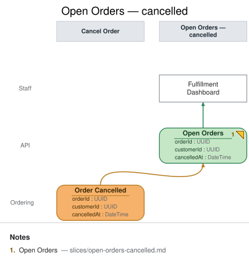

# Slice: Open Orders — cancelled

## Intent
Once a customer can self-serve cancel (`slices/cancel-order.md`), the staff fulfillment board
needs to stop showing that order as something to prepare and ship. This slice is a **later
instance of the same `Open Orders` read model** (`view Open Orders again from "Order Cancelled"`)
— not a new view. It exists to demonstrate the repeated-view rule live: this instance and the
earlier `Open Orders` instance (`slices/open-orders.md`) share a name and are never connected to
one another; continuity is implied only by that shared name, and the event each instance folds is
what shows the view changing over time.

## Trigger & Actor
No user action triggers this slice directly — it's a projection that updates automatically
whenever `Order Cancelled` (`slices/cancel-order.md`) is recorded. **Staff** consult the same
**Fulfillment Dashboard** on demand; this slice owns its own `ui` element per the repeated-view
rule (each instance gets its own consumer), even though staff experience it as one continuously
updating board, not two.

## Read Model / View
- **View:** `Open Orders` (repeated instance) built from event: `Order Cancelled`
- **Consumed by:** `Fulfillment Dashboard` @Staff (this slice's own `ui`, distinct from the earlier
  instance's `ui` element, per the repeated-view rule)
- **Freshness / consistency expectation:** eventual — same as the earlier instance
  (`slices/open-orders.md`): staff read a projection that lags event recording by however long the
  projector takes to catch up.

## Invariants / Business Rules
- **INV-OOC-1:** The fold removes (or marks) the cancelled order from the staff board: when
  `Order Cancelled` is projected for an `orderId` with an existing row (from the earlier
  `Order Placed` fold), that row is removed from the "needs fulfillment" board — a cancelled
  order is no longer something staff should prepare or ship.
  - Design call: this doc models the fold as a **removal**, not a "cancelled" status flag left
    visible on the board, because an already-cancelled order carries no further fulfillment
    action for staff to take; a full order-history view (that would want to keep cancelled rows
    visible with a status) is a distinct, unmodeled read model.
- **INV-OOC-2 (idempotent):** Re-projecting the same `Order Cancelled` event (redelivery, replay,
  projector restart) never re-removes an already-removed row, errors, or has any additional
  effect — removal is idempotent the same way the earlier instance's fold is
  (`slices/open-orders.md`'s INV-OO-1).

## Scenarios (Given / When / Then)
- **`Order Cancelled` lands for an open order**
  - **Given:** an `Open Orders` row exists for `orderId` `O1` (from an earlier `Order Placed`
    fold, per `slices/open-orders.md`)
  - **When:** `Order Cancelled` is projected for `O1`
  - **Then:** the `O1` row is removed from the fulfillment board.
- **Redelivered event (INV-OOC-2)**
  - **Given:** the `O1` row has already been removed by a prior `Order Cancelled` projection
  - **When:** that same event is redelivered to the projector (at-least-once delivery, replay)
  - **Then:** nothing further happens — no error, no second effect.
- **Cancellation before capture reaches the board**
  - **Given:** `O1` was open (no `capturedAt` yet) when it was cancelled
  - **When:** `Order Cancelled` is projected
  - **Then:** `O1` is removed the same way as a captured order would be — this fold doesn't
    distinguish by the row's prior `capturedAt` state, since INV-CO-1 already guarantees
    `Order Cancelled` is never recorded once payment has captured.

## Alternate & Error Flows
- **Out-of-order delivery:** if `Order Cancelled` were somehow projected before its order's
  `Order Placed` (not expected in-order, but a projector should be defensive), the fold has no row
  to remove yet; it records that the order is cancelled so the eventual `Order Placed` projection
  can skip creating a row for it, rather than erroring on a missing row.
- **Idempotency mechanism:** the projector folds by `orderId`, the same key `slices/open-orders.md`
  uses, so replay/redelivery is naturally idempotent (INV-OOC-2) as long as "remove" is itself an
  idempotent operation (removing an already-absent row is a no-op, not an error).

## Non-Functional Requirements
- **Security / authz:** visible to Staff only (fulfillment/ops role); not exposed to Customers —
  same as the earlier instance.
- **PII & compliance:** carries only `orderId` and `customerId` (a reference, not raw PII) as read
  from `Order Cancelled`; no payment instrument data.
- **Performance / SLA:** none beyond ordinary dashboard-refresh latency for this demo.

## Dependencies & Read Models Affected
- **Upstream events this slice relies on:** `Order Cancelled` (`slices/cancel-order.md`).
- **Downstream read models / slices affected:** none — this is a terminal read model for the Staff
  persona, the same as the earlier `Open Orders` instance.

## Open Questions
- [x] Does the base `Open Orders` view (`slices/open-orders.md`) need to change now that
  cancellation exists? **Resolved:** no — that doc's own Open Question already deferred
  cancellation explicitly and remains accurate as written; this repeated instance is the whole
  change, not an edit to the earlier one (see the Intent section above and
  `repeated-views-never-connect`).
