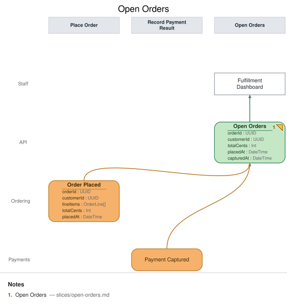

# Slice: Open Orders

## Intent
Staff need a single working list of orders that have been placed but not yet fully paid and
fulfilled, so they know what to prepare and ship. This view is Meridian Goods' operational
front door for order fulfillment.

## Trigger & Actor
No user action triggers this slice directly — it's a projection that updates automatically
whenever `Order Placed` (this model's `slices/place-order.md`) or `Payment Captured` (owned by
the payments slices) is recorded. **Staff** consult it on demand via the **Fulfillment
Dashboard**.

## Read Model / View
- **View:** `Open Orders` built from events: `Order Placed`, `Payment Captured`
- **Consumed by:** `Fulfillment Dashboard` @Staff
- **Freshness / consistency expectation:** eventual — staff read a projection that lags event
  recording by however long the projector takes to catch up; there is no synchronous read of the
  write side.

## Invariants / Business Rules
- **INV-OO-1:** The fold is idempotent. Re-projecting the same `Order Placed` or
  `Payment Captured` event (redelivery, replay, projector restart) never creates a duplicate row
  or double-applies a field — each order appears exactly once, keyed by `orderId`.
- **INV-OO-2:** `capturedAt` is populated **only** when a `Payment Captured` event has actually
  been projected for that `orderId`; until then it stays genuinely absent (`null`), never
  backfilled, defaulted, or guessed from elapsed time. The row's shape always reflects which
  events have actually landed, not an inference about what "should" have happened by now.

## Scenarios (Given / When / Then)
- **`Order Placed` lands** — Given no prior row for this `orderId`, When `Order Placed` is
  projected, Then a new `Open Orders` row appears with `orderId`, `customerId`, `totalCents`,
  `placedAt` populated and `capturedAt` absent.
- **`Payment Captured` lands** — Given an existing `Open Orders` row for this `orderId` (from a
  prior `Order Placed`), When `Payment Captured` is projected, Then that same row is updated in
  place with `capturedAt` populated — no new row is created (INV-OO-1).
- **Redelivered event (INV-OO-1)** — Given an `Open Orders` row already reflects a given
  `Order Placed` (or `Payment Captured`) event, When that same event is redelivered to the
  projector (at-least-once delivery, replay), Then the row is unchanged — no duplicate row, no
  field double-applied.

## Alternate & Error Flows
- **Out-of-order delivery:** if `Payment Captured` were somehow projected before its matching
  `Order Placed` (not expected in-order, but a projector should be defensive), the projector
  creates the row from whichever event lands first and fills in the rest as later events arrive —
  it never rejects an event for arriving "early."
- **Idempotency mechanism:** the projector folds by `orderId`, so replay/redelivery is naturally
  idempotent (INV-OO-1) as long as the fold logic is itself pure — no counters, no "add one more
  line" style updates that would double on replay.

## Non-Functional Requirements
- **Security / authz:** visible to Staff only (fulfillment/ops role); not exposed to Customers.
- **PII & compliance:** carries `customerId` (a reference, not raw PII) and order totals; no
  payment instrument data.
- **Performance / SLA:** none beyond ordinary dashboard-refresh latency for this demo.

## Dependencies & Read Models Affected
- **Upstream events this slice relies on:** `Order Placed` (`slices/place-order.md`),
  `Payment Captured` (payments slices, owned separately — field names `orderId`, `capturedAt`
  match this view's fields by the shared field contract).
- **Downstream read models / slices affected:** none — this is a terminal read model for the
  Staff persona in this model.

## Open Questions
- [x] Does a fulfilled/shipped order ever leave this list? **Resolved (deferred):** not in this
  model — fulfillment and cancellation are out of scope for the base slices (see
  `domain-decisions.md`'s cancellation-deferred bullet). `Open Orders` shows every placed order
  regardless of downstream fulfillment state for now.
