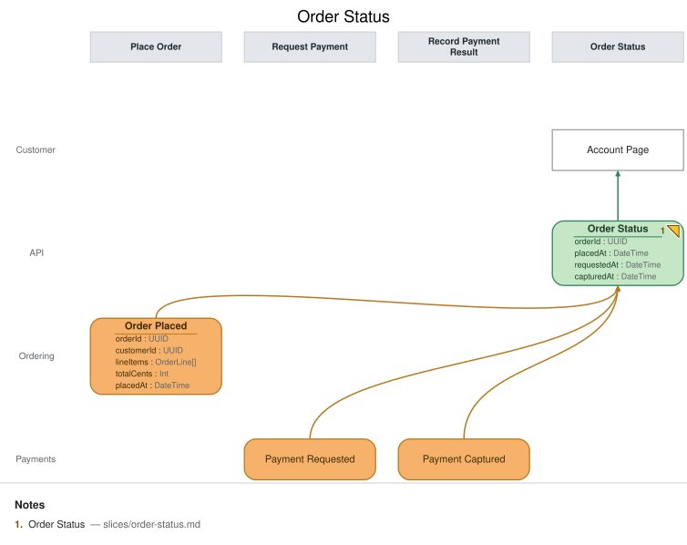

# Slice: Order Status

## Intent
A customer wants to know where their order stands — placed, payment requested, or paid —
without contacting support. This view closes the loop for every event this base model records
about an order, so it's deliberately the last slice fed by all three ordering/payment events.

## Trigger & Actor
No user action triggers this slice directly — it's a projection that updates automatically as
`Order Placed`, `Payment Requested`, or `Payment Captured` land for a given order. The
**Customer** consults it on demand via the **Account Page**.

## Read Model / View
- **View:** `Order Status` built from events: `Order Placed`, `Payment Requested`,
  `Payment Captured`
- **Consumed by:** `Account Page` @Customer
- **Freshness / consistency expectation:** eventual — the customer's view lags event recording
  by ordinary projector latency; no synchronous read of the write side.

## Invariants / Business Rules
- **INV-OS-1:** The fold is idempotent.
  - Re-projecting the same source event (redelivery, replay, projector restart) never creates a
    duplicate row or double-applies a field — each order's status row is keyed by `orderId` and
    appears exactly once.
- **INV-OS-2:** "Status" is never a separately stored or inferred field — it is derived purely
  from which timestamp fields are actually populated (`placedAt` only ⇒ placed;
  `+ requestedAt` ⇒ payment requested; `+ capturedAt` ⇒ paid).
  - There is no independent `status` enum that could drift out of sync with the underlying
    event facts, and no field is ever populated by inference, elapsed time, or assumption about
    what "should" have happened — only by the corresponding event actually landing.

## Scenarios (Given / When / Then)
- **`Order Placed` lands**
  - **Given:** no prior row for this `orderId`
  - **When:** `Order Placed` is projected
  - **Then:** a new `Order Status` row appears with `orderId` and `placedAt` populated,
    `requestedAt`/`capturedAt` absent, reading as "placed" (INV-OS-2).
- **`Payment Requested` lands**
  - **Given:** an existing row with `placedAt` set
  - **When:** `Payment Requested` is projected
  - **Then:** that row is updated in place with `requestedAt` populated, reading as "payment
    requested" — no new row is created (INV-OS-1).
- **`Payment Captured` lands**
  - **Given:** an existing row with `placedAt` and `requestedAt` set
  - **When:** `Payment Captured` is projected
  - **Then:** that row is updated in place with `capturedAt` populated, reading as "paid" — no
    new row is created (INV-OS-1).
- **Redelivered event (INV-OS-1)**
  - **Given:** a row already reflects a given source event
  - **When:** that same event is redelivered to the projector
  - **Then:** the row is unchanged — no duplicate row, no field double-applied, and the
    derived status (INV-OS-2) doesn't change either.

## Alternate & Error Flows
- **No payment yet:** an order can sit indefinitely at "placed" (`requestedAt`/`capturedAt` both
  absent) if the payment-request automation hasn't run yet or payment hasn't been captured — the
  view shows this honestly rather than assuming a stuck request means failure.
- **Idempotency mechanism:** same as `Open Orders` — the projector folds by `orderId`, and each
  event sets only its own field(s), so replay/redelivery is naturally idempotent (INV-OS-1).

## Non-Functional Requirements
- **Security / authz:** a customer may only view their own order's status (enforced upstream of
  this slice).
- **PII & compliance:** carries `orderId` and timestamps only; no payment instrument data.
- **Performance / SLA:** none beyond ordinary interactive read latency for this demo.

## Dependencies & Read Models Affected
- **Upstream events this slice relies on:** `Order Placed` (`slices/place-order.md`);
  `Payment Requested` and `Payment Captured` (payments slices, owned separately — field names
  `orderId`, `requestedAt`, `capturedAt` match this view's fields by the shared field contract).
- **Downstream read models / slices affected:** none — this is a terminal read model for the
  Customer persona in this model.

## Open Questions
- [x] Should a failed/declined payment show as its own status? **Resolved (deferred):** this
  base model has no "payment failed" event yet — only requested/captured — so `Order Status`
  only ever reads as placed / payment requested / paid. A failure-path event is out of scope for
  these three slices.
