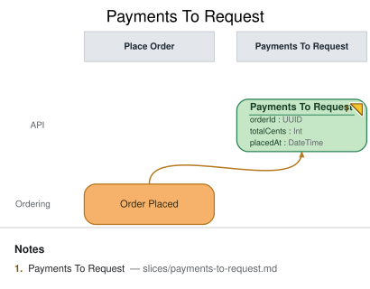

# Slice: Payments To Request

## Intent
Every placed order needs a payment requested from the provider before it can be fulfilled. This
slice is the Request Payment automation's to-do list: a queryable projection of orders that have
been placed but not yet had a payment request issued, so the `Payment Requester` processor (in the
next slice, `Request Payment`) knows exactly what work remains without re-scanning the full order
history.

## Trigger & Actor
No user-facing trigger — this is a pure projection. It is rebuilt by folding `Order Placed`
events as they arrive. Its "actor" is the `Payment Requester` processor, which reads it in the
`Request Payment` slice via `from "Payments To Request"`.

## Read Model / View
- **View:** `Payments To Request` built from events: `Order Placed`
- **Consumed by:** processor `Payment Requester` (slice `Request Payment`)
- **Freshness / consistency expectation:** eventual — the projection lags `Order Placed` by
  normal event-processing latency; the automation tolerates this because Request Payment's own
  exactly-once invariant (see `slices/request-payment.md`, `INV-RP-1`) is enforced independently
  of how fast this queue catches up.

| Field | Type | Immutable Fact? | Source / Notes |
|-------|------|-----------------|----------------|
| orderId | UUID | yes | `Order Placed.orderId` — the fold key; one to-do entry per order |
| totalCents | Int | yes | `Order Placed.totalCents` — carried through unchanged so the automation can size the payment request without a second lookup |
| placedAt | DateTime | yes | `Order Placed.placedAt` — carried through for staleness/SLA monitoring on the queue itself |

## Invariants / Business Rules
- **INV-PTR-1 (idempotent fold):** Folding the same `Order Placed` event more than once (e.g. a
  projection rebuild, or an at-least-once delivery redelivering the event) must never produce more
  than one queue entry for a given `orderId`. The fold is an upsert keyed on `orderId`, not an
  append — replay-safety here is what makes `em conform`-style rebuilds and redelivery both safe.
- **INV-PTR-2 (removal on request):** An order is removed from `Payments To Request` once a
  `Payment Requested` event exists for its `orderId` (recorded by the `Request Payment` slice that
  watches this queue). This is the invariant that keeps the to-do list draining: without it, the
  `Payment Requester` processor would re-request payment for the same order on every poll — the
  classic "to-do list that never drains" bug. The removal is driven by `Payment Requested`, not by
  `Payment Captured`, because the queue's job is "has a request been *issued*", not "has it been
  *paid*" — a slow or failed provider response must not cause a duplicate request (see
  `slices/request-payment.md`, `INV-RP-1`).

## Scenarios (Given / When / Then)
- **Happy path** — Given no prior events for order `O1`, When `Order Placed` (orderId `O1`,
  totalCents `5000`, placedAt `2026-08-20T10:00:00Z`) is recorded, Then `Payments To Request`
  gains one entry for `O1` (totalCents `5000`).
- **Idempotent fold (INV-PTR-1)** — Given `Order Placed` for `O1` has already been folded once,
  When the same `Order Placed` event is folded again (rebuild or redelivery), Then
  `Payments To Request` still holds exactly one entry for `O1`, not two.
- **Drains on request (INV-PTR-2)** — Given `O1` is present in `Payments To Request`, When
  `Payment Requested` for `O1` is recorded (in the `Request Payment` slice), Then `O1` is removed
  from `Payments To Request` and the `Payment Requester` processor never re-selects it.
- **Untouched by capture** — Given `O1` has already been removed from `Payments To Request` by its
  `Payment Requested` event, When `Payment Captured` for `O1` is later recorded, Then
  `Payments To Request` is unaffected (it isn't a source for this view) — capture outcomes are the
  concern of `Order Status` and `Open Orders`, not this to-do list.

## Alternate & Error Flows
- **Rebuild from scratch:** replaying the full `Order Placed` history against an empty projection
  must converge to the same state as incremental folding (INV-PTR-1 covers this).
- **Out-of-order delivery:** if `Payment Requested` for an order is somehow processed before that
  order's `Order Placed` fold completes, the upsert-then-remove sequencing must still leave the
  order absent from the queue once both events have been folded, not resurrected.

## Non-Functional Requirements
- **Security / authz:** none — internal-only projection, not exposed via any `ui`/API in this
  model.
- **PII & compliance:** none beyond what `Order Placed` already carries (order total, not
  customer-identifying data at this projection).
- **Performance / SLA:** eventual; the `Payment Requester` automation's own responsiveness
  budget (see `slices/request-payment.md`) is what bounds acceptable staleness here, not a
  freshness target of this view in isolation.

## Dependencies & Read Models Affected
- **Upstream events this slice relies on:** `Order Placed` (owned by the `Place Order` slice).
- **Downstream read models / slices affected:** `Request Payment` (the `Payment Requester`
  processor reads this view to decide what to act on).

## Open Questions
- [x] Should cancelled/refunded orders be excluded from this queue? Resolved: out of scope for
  this model revision — Meridian Goods has no cancellation slice yet; revisit if one is added.
- [x] Does the queue need a max-age/alerting concern for orders stuck without a payment request?
  Resolved: not modeled here — an operational concern for the `Request Payment` implementation
  (e.g. a metric/alert on queue age), not a change to this view's shape.
