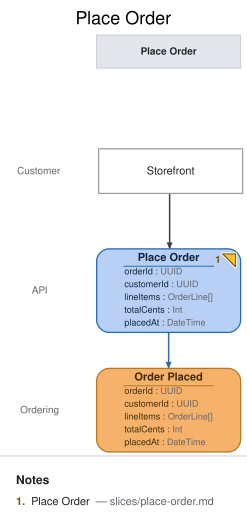

# Slice: Place Order

## Intent
A customer turns their cart into a firm order. This is the deep-dive slice for the Meridian
Goods walkthrough: it anchors the demo's idempotency story (client-generated `orderId`) and its
money-handling story (integer cents, total derived from line items) — see
[`domain-decisions.md`](../domain-decisions.md).

## Trigger & Actor
The **Customer**, from the **Storefront** screen, submits their cart at checkout. Each submit
issues exactly one `Place Order` command; a retried submit (double-click, client timeout, network
retry) reuses the same client-generated `orderId` rather than minting a new one — that reuse is
what makes idempotent placement (INV-PO-1) meaningful.

## Command / Input
**Command:** `Place Order`

| Field | Type | Required | Rules / Validation |
|-------|------|----------|--------------------|
| orderId | UUID | yes | Client-generated (not server-assigned). Doubles as the idempotency key — see INV-PO-1 and [`domain-decisions.md`](../domain-decisions.md#client-generated-orderid-for-idempotency). |
| customerId | UUID | yes | Identifies the customer placing the order. Customer existence/auth is enforced upstream of this slice (out of scope here). |
| lineItems | OrderLine[] | yes | At least one entry (INV-PO-3). Each `OrderLine`: `sku` (string, required, identifies the product), `quantity` (int, must be > 0 — INV-PO-4), `priceCents` (int, unit price snapshotted at order time, >= 0). |
| totalCents | Int | yes | Must equal Σ (`priceCents` × `quantity`) across `lineItems` — INV-PO-2. The server recomputes and verifies this; it never trusts a client-supplied total blindly. |
| placedAt | DateTime | no | **Modeling note, not a real request field:** this is the server clock's timestamp at command-handling time, not something the client sends. It appears on the command element here only so the DSL's event-field/command-field completeness check (`em validate`, `fields-completeness/event-field-no-source`) can trace `Order Placed.placedAt` to a same-slice origin — the tool has no separate "system-assigned at handling time" field category. The actual API request body excludes it. See **Open Questions** for the judgment call this represents. |

## Trigger
**Triggered by:** screen `Storefront` @Customer

## Event(s) Emitted
**Event:** `Order Placed` → context `Ordering`
**Read by:** `Payments To Request` view (next slice, feeds the payment-request automation), `Open Orders` view (this branch's `slices/open-orders.md`), `Order Status` view (`slices/order-status.md`)

| Field | Type | Immutable Fact? | Source / Notes |
|-------|------|-----------------|----------------|
| orderId | UUID | yes | Copied from the command; the order's identity for the rest of its lifecycle. |
| customerId | UUID | yes | Copied from the command. |
| lineItems | OrderLine[] | yes | Copied from the command — a snapshot of what was ordered and at what price, immune to later catalog/price changes. |
| totalCents | Int | yes | Copied from the command, after the server has verified it equals Σ line items (INV-PO-2). |
| placedAt | DateTime | yes | Server clock at the moment the event is recorded — the actual, meaningful origin of this field (see the Command/Input note above on why it's echoed there too). |

## Invariants / Business Rules
- **INV-PO-1:** Placement is idempotent by client-supplied `orderId`. A `Place Order` command
  whose `orderId` already has a recorded `Order Placed` event is **not** a new order: if the
  resubmitted payload is identical, the command is a no-op that returns the original result
  without appending a second event; if the payload differs, the command is rejected as a
  conflict (the same `orderId` can never back two different orders).
- **INV-PO-2:** `totalCents` must equal Σ (`priceCents` × `quantity`) over all `lineItems`. The
  server computes this itself and rejects a command whose supplied `totalCents` disagrees —
  the client's total is never taken on faith.
- **INV-PO-3:** An order must contain at least one line item. A `lineItems` array with zero
  entries is rejected — there is no such thing as an empty order.
- **INV-PO-4:** Every line item's `quantity` must be a positive integer. Zero, negative, or
  fractional quantities are rejected line-item-by-line-item (the whole command fails; no partial
  order is created).

## Scenarios (Given / When / Then)
- **Happy path** — Given a customer with a non-empty cart of 2 line items whose prices and
  quantities sum correctly, When they submit `Place Order` with a fresh `orderId`, Then
  `Order Placed` is recorded with the submitted `orderId`, `customerId`, `lineItems`, `totalCents`,
  and a server-assigned `placedAt`; the order becomes visible on `Open Orders` and `Order Status`.
- **Rejected — total mismatch (INV-PO-2)** — Given a cart of 2 line items whose true sum is
  4200 cents, When `Place Order` is submitted with `totalCents: 4000`, Then the command is
  rejected with a total-mismatch reason and no `Order Placed` event is recorded.
- **Rejected — empty order (INV-PO-3)** — Given a cart with zero line items, When `Place Order`
  is submitted, Then the command is rejected as an empty order and no event is recorded.
- **Rejected — invalid quantity (INV-PO-4)** — Given a cart containing one line item with
  `quantity: -1` (or `0`), When `Place Order` is submitted, Then the command is rejected citing
  the offending line item and no event is recorded.
- **Duplicate-`orderId` retry (INV-PO-1)** — Given an `Order Placed` event already recorded for
  `orderId: X` from an earlier successful submit, When the customer's client retries `Place Order`
  with the same `orderId: X` and the identical payload (e.g. after a timed-out response), Then no
  second `Order Placed` event is recorded and the command returns the original order's result —
  the customer is never double-charged or double-fulfilled from a retried click.
- **Conflicting duplicate `orderId` (INV-PO-1)** — Given an `Order Placed` event already recorded
  for `orderId: X`, When a `Place Order` command arrives reusing `orderId: X` but with different
  `lineItems`/`totalCents`, Then the command is rejected as a conflict and no second event is
  recorded — a reused `orderId` never silently mutates or replaces the original order.

## Alternate & Error Flows
- **Idempotent retry:** see INV-PO-1 and its two scenarios above — same-payload replay is a
  silent no-op; different-payload replay is a rejected conflict. This is the mechanism that lets
  the client safely retry on any ambiguous outcome (timeout, dropped connection) without a
  reconciliation step.
- **Validation failures (INV-PO-2/3/4) never partially apply.** The command either fully
  succeeds (one `Order Placed` event, fully formed) or fully fails (no event at all); there is no
  partially-recorded order.
- **Downstream failure isolation:** a failure in the automation that requests payment
  (`Request Payment`, the next slice) never rolls back `Order Placed` — the order is already a
  recorded fact once its event is written. Payment failure is handled entirely in that later
  slice's own error flow.

## Non-Functional Requirements
- **Security / authz:** the Customer must be authenticated and may only place an order for their
  own `customerId` (enforced upstream of this slice).
- **PII & compliance:** `customerId` links to personal data held elsewhere; no PII is stored
  directly in this event's payload beyond that reference.
- **Performance / SLA:** none beyond ordinary interactive request latency — no special SLA for
  this demo.

## Dependencies & Read Models Affected
- **Upstream events this slice relies on:** none — this is the originating write for an order.
- **Downstream read models / slices affected:** `Payments To Request` (feeds the payment
  automation), `Open Orders` (staff fulfillment view), `Order Status` (customer-facing view) —
  all three project `Order Placed`.

## Open Questions
- [x] Should `placedAt` be a real client-supplied field, or server-assigned? **Resolved:**
  server-assigned at command-handling time. It's listed on the `Place Order` command element in
  the `.em` model purely so `em validate`'s field-flow completeness check can trace it — the
  Command/Input table above documents that this is a modeling artifact, not a real request field.
  See the findings file (`w2a-ordering-docs.md`) for the fuller judgment call.
- [x] What happens on a duplicate `orderId` with a *different* payload? **Resolved:** rejected as
  a conflict, never silently applied and never treated as a second order — see INV-PO-1 and its
  "Conflicting duplicate `orderId`" scenario.
