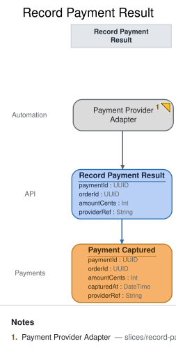

# Slice: Record Payment Result

## Intent
The payment provider tells Meridian Goods, out of band, that a payment succeeded — via a webhook
call the provider makes on its own schedule. This slice is the anti-corruption seam between the
provider's wire format and our domain: it translates that external notification into our own
`Record Payment Result` command, so the rest of the system only ever deals with our vocabulary
(`Payment Captured`), never the provider's payload shape.

## Trigger & Actor
Externally triggered, no durable artifact: the provider's webhook call is the `Payment Provider
Adapter` translation's input directly — there is no persisted inbound queue behind it in this
model (no `from`, no slice before this one). The adapter maps the provider's payload to our
command at the boundary and issues it; it never records an event itself.

## Command / Input
**Command:** `Record Payment Result`

| Field | Type | Required | Rules / Validation |
|-------|------|----------|--------------------|
| paymentId | UUID | yes | Must name a `paymentId` already recorded by a `Payment Requested` event — see INV-RPR-3; the adapter maps this from whatever correlation identifier the provider's payload carries for our original request. |
| orderId | UUID | yes | Mapped from the provider payload; must match the `orderId` already associated with `paymentId` via `Payment Requested`. |
| amountCents | Int | yes | Mapped from the provider's captured-amount field; the command carries our own integer-cents representation, not the provider's native format (which may be a decimal string or a different currency-minor-unit convention). |
| capturedAt | DateTime | yes | Mapped from the provider payload's capture-time field — the provider's authoritative clock, crossing the INV-RPR-1 seam as a typed field like everything else. |
| providerRef | String | yes | The provider's own identifier for this capture event (e.g. their charge/transaction id). This is the idempotency key for INV-RPR-1 — a retried webhook for the same underlying capture carries the same `providerRef`. |

## Trigger
**Triggered by:** translation `Payment Provider Adapter`, also in this slice.

## Event(s) Emitted
**Event:** `Payment Captured` → context `Payments`
**Read by:** `Open Orders` (staff-facing, in the `Open Orders` slice) and `Order Status`
(customer-facing, in the `Order Status` slice).

| Field | Type | Immutable Fact? | Source / Notes |
|-------|------|-----------------|----------------|
| paymentId | UUID | yes | `Record Payment Result.paymentId` |
| orderId | UUID | yes | `Record Payment Result.orderId` |
| amountCents | Int | yes | `Record Payment Result.amountCents` |
| capturedAt | DateTime | yes | Carried in the provider's webhook payload — the *provider's* capture time, mapped onto `Record Payment Result.capturedAt` at the anti-corruption boundary (INV-RPR-1). Not a server echo; the provider is the authoritative source of when capture happened (see `domain-decisions.md`, timestamp-origin convention). |
| providerRef | String | yes | `Record Payment Result.providerRef` — kept on the event (not just the command) so downstream reconciliation against the provider's own records never has to re-derive it. |

## Invariants / Business Rules
- **INV-RPR-1 (anti-corruption seam):** The provider's raw webhook payload never enters the
  domain event. The `Payment Provider Adapter` maps the provider's wire shape (whatever fields,
  encodings, and vocabulary the provider uses) onto the fixed `Record Payment Result` command
  fields at the boundary; `Payment Captured` only ever carries our own typed, named fields
  (`paymentId`, `orderId`, `amountCents`, `capturedAt`, `providerRef`). If the provider changes
  its payload shape, only the adapter's mapping changes — the command, the event, and every
  downstream reader are unaffected.
- **INV-RPR-2 (idempotent under retries):** Payment providers redeliver webhooks (at-least-once
  delivery is standard practice for this class of integration). A retried webhook carrying the
  same `providerRef` as one already processed must never produce a second `Payment Captured`
  event — the adapter (or the command handler it calls) treats a repeat `providerRef` as a no-op,
  not a new fact. This is what makes the boundary safe to expose to a provider that retries on
  timeout, not just on genuine failure.
- **INV-RPR-3 (unknown paymentId is a rejection, not a fact):** If the webhook's mapped
  `paymentId` does not correspond to any `Payment Requested` event Meridian Goods has recorded,
  `Record Payment Result` is rejected — no `Payment Captured` event is recorded. A capture result
  for a payment we never requested is not a fact about our system; recording it anyway would let
  an external actor (or a misconfigured/malicious webhook) inject state we never asked for.

## Scenarios (Given / When / Then)
- **Happy path** — Given `Payment Requested` exists for `paymentId` `P1` / `orderId` `O1`, When
  the provider's webhook reports a capture for `P1` (amountCents `5000`, providerRef `ch_abc123`),
  Then the adapter maps it to `Record Payment Result` and `Payment Captured` is recorded for `P1`
  with `providerRef` `ch_abc123`.
- **Idempotent retry (INV-RPR-2)** — Given `Payment Captured` for `P1` has already been recorded
  with `providerRef` `ch_abc123`, When the provider redelivers the identical webhook (same
  `providerRef`) after a timeout on its side, Then no second `Payment Captured` event is recorded
  — the retry is a no-op.
- **Distinct providerRef is a distinct fact** — Given `Payment Captured` for `P1` already exists
  with `providerRef` `ch_abc123`, When a *different* webhook arrives for `P1` carrying a different
  `providerRef` (e.g. a genuinely separate capture attempt the provider assigns a new id to),
  Then this is treated as a new event only if the domain actually allows a second capture for the
  same payment — in this model it does not (a payment is captured once), so this case is rejected
  the same way an unknown-context duplicate would be; the `providerRef` distinguishes retries from
  new facts, it does not by itself authorize multiple captures per payment.
- **Rejected — unknown paymentId (INV-RPR-3)** — Given no `Payment Requested` event exists for
  `paymentId` `P9`, When a webhook reports a capture for `P9`, Then `Record Payment Result` is
  rejected and no `Payment Captured` event is recorded.

## Alternate & Error Flows
- **Webhook retries:** covered by INV-RPR-2 — same `providerRef` in, no duplicate event out.
- **Unknown paymentId:** covered by INV-RPR-3 — rejected at the command boundary, surfaced back to
  the provider integration as a failure response (e.g. so it can alert rather than silently
  retrying forever against a payment id that will never resolve).
- **Malformed/partial provider payload:** a payload missing fields the adapter needs to populate
  the command is rejected at the translation boundary before it ever becomes a command attempt —
  this is the adapter's own input validation, upstream of the command's own required-field checks.

## Non-Functional Requirements
- **Security / authz:** the webhook endpoint must authenticate the caller as the actual payment
  provider (e.g. signature verification on the raw payload) before the adapter maps and acts on
  it — modeled here as a precondition of the translation running at all, not as a command field.
- **PII & compliance:** the provider payload may carry more than what's mapped through (card
  metadata, customer contact fields); INV-RPR-1 is also what keeps that data from ever reaching
  our event store — only the four mapped/derived fields cross the seam.
- **Performance / SLA:** none modeled — webhook processing is expected to complete well within the
  provider's own retry/timeout window, which is what makes INV-RPR-2 exercise in practice rather
  than in theory.

## Dependencies & Read Models Affected
- **Upstream events this slice relies on:** `Payment Requested` (owned by the `Request Payment`
  slice) — referenced only to validate `paymentId` (INV-RPR-3), not consumed as a `view` source
  (this translation has no durable artifact / no `from`).
- **Downstream read models / slices affected:** `Open Orders`, `Order Status` (both read
  `Payment Captured`).

## Open Questions
- [x] Should a rejected webhook (unknown paymentId) be persisted anywhere for audit/debugging?
  Resolved: out of scope for this model revision — no inbound-queue durable artifact exists for
  this translation (see the no-durable-artifact form in `reference/methodology.md` §Translation);
  logging/alerting on rejection is an implementation concern, not a modeled read model.
- [x] Does a provider decline (as opposed to a capture) need its own event? Resolved: not modeled
  in this revision — this slice only translates successful captures; a decline/failure notification
  would need its own event and command, left as a known future extension (see also the matching
  open question in `slices/request-payment.md`).
