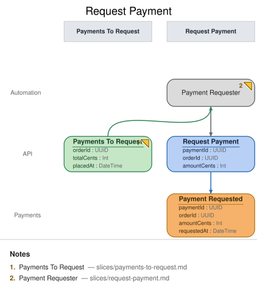

# Slice: Request Payment

## Intent
Once an order exists, Meridian Goods must ask the payment provider to collect funds for it —
without a human triggering that call, and without ever asking twice for the same order. This
slice is the automation half of that flow: it watches the `Payments To Request` to-do list and
turns each entry into exactly one outgoing payment request.

## Trigger & Actor
Internally triggered. The `Payment Requester` processor watches the `Payments To Request` view
(built in the slice before, from `Order Placed`) and, for each order it finds there, issues the
`Request Payment` command. The processor never records `Payment Requested` itself — the command it
triggers does.

## Command / Input
**Command:** `Request Payment`

| Field | Type | Required | Rules / Validation |
|-------|------|----------|--------------------|
| paymentId | UUID | yes | Minted by the processor when it decides to act — the idempotency key for this payment attempt; stable across retries of the *same* decision. |
| orderId | UUID | yes | Must name an order present in `Payments To Request` at the time the processor acts. |
| amountCents | Int | yes | Must equal the `totalCents` carried on that order's `Payments To Request` entry (INV-RP-2) — the processor never invents or adjusts the amount. |

## Trigger
**Triggered by:** processor `Payment Requester`, also in this slice.

## Event(s) Emitted
**Event:** `Payment Requested` → context `Payments`
**Read by:** `Payments To Request` (removed — INV-PTR-2, `slices/payments-to-request.md`) and
`Order Status` (the customer-facing view, in the `Order Status` slice).

| Field | Type | Immutable Fact? | Source / Notes |
|-------|------|-----------------|----------------|
| paymentId | UUID | yes | `Request Payment.paymentId` |
| orderId | UUID | yes | `Request Payment.orderId` |
| amountCents | Int | yes | `Request Payment.amountCents` |
| requestedAt | DateTime | yes | Stamped by the issuing automation: `Payment Requester` is the command's author, so it legitimately supplies the request time on `Request Payment.requestedAt` — carried on both command and event (see `domain-decisions.md`, timestamp-origin convention). |

## Invariants / Business Rules
- **INV-RP-1 (exactly-once liveness):** At most one `Payment Requested` event is ever recorded
  per `orderId`. The processor's decision to act is driven by an order's *presence* in
  `Payments To Request` — once `Payment Requested` lands, `INV-PTR-2` removes the order from that
  queue, so the processor structurally cannot re-select it on a later poll. Idempotency is
  enforced on the read side (the to-do list draining), not by deduplicating on `paymentId` at
  write time — the command's `paymentId` is the processor's own idempotency key for retrying its
  *own* in-flight attempt, not a dedupe key across separate decisions.
- **INV-RP-2 (amount fidelity):** `Request Payment.amountCents` must equal the order's own
  `totalCents` as carried on its `Payments To Request` entry — traced back to `Order Placed`. The
  processor is a pure conduit for this value; it never recomputes, discounts, or rounds it.
- **INV-RP-3 (no direct recording):** The payment processor/provider integration never records
  `Payment Requested` (or any event) directly. Every outbound request funnels through the
  `Request Payment` command, so the same validation and idempotency guarantees apply whether the
  request was triggered by the normal automation path or replayed for recovery. There is no
  back-door write path from the provider-facing code straight into the event stream.

## Scenarios (Given / When / Then)
- **Happy path** — Given order `O1` (totalCents `5000`) is present in `Payments To Request`, When
  the `Payment Requester` processor selects it and issues `Request Payment` (orderId `O1`,
  amountCents `5000`), Then `Payment Requested` is recorded for `O1` and `O1` is removed from
  `Payments To Request`.
- **Exactly-once under re-poll (INV-RP-1)** — Given `O1` has already produced a `Payment Requested`
  event (and so is no longer in `Payments To Request`), When the processor's next poll runs over
  the queue, Then `O1` is not present to select and no second `Request Payment` command is issued
  for it.
- **Amount fidelity (INV-RP-2)** — Given `O1`'s `Payments To Request` entry carries totalCents
  `5000`, When the processor issues `Request Payment` for `O1`, Then `amountCents` on that command
  (and the resulting event) is `5000` — never a different value.
- **No back-door writes (INV-RP-3)** — Given the payment provider integration code path, When it
  needs to reflect that a request went out, Then it does so only by having already gone through
  `Request Payment` — there is no code path that appends `Payment Requested` without that command
  having run first.

## Alternate & Error Flows
- **Processor crash mid-cycle:** if the processor crashes after issuing `Request Payment` but
  before its own bookkeeping completes, the next run must not re-issue the command for the same
  order — covered by INV-RP-1, since the order is already absent from `Payments To Request` once
  the event lands.
- **Idempotent command retry:** if the *same* in-flight `Request Payment` (same `paymentId`) is
  retried due to a transport-level timeout, the command handler treats a repeat of an already-
  recorded `paymentId` as a no-op rather than a second event — this is the processor's own
  retry-safety, distinct from INV-RP-1's cross-decision exactly-once guarantee.
- **Provider call failure:** a downstream failure to actually reach the payment provider is an
  implementation concern of the command handler (retry/backoff), not modeled as a rejection here —
  `Request Payment` records the *request* being made, not the provider's acknowledgment of it.

## Non-Functional Requirements
- **Security / authz:** none beyond internal system trust — this command is issued only by the
  `Payment Requester` processor, never by an external caller or `ui`.
- **PII & compliance:** none beyond the order total already carried by `Payments To Request`; no
  card/account data flows through this command (payment method details are the provider
  integration's concern, not this model's).
- **Performance / SLA:** the automation's poll/reaction latency bounds how quickly an order moves
  from "placed" to "payment requested" — no hard SLA modeled here, but this is the responsiveness
  budget referenced by `slices/payments-to-request.md`'s freshness note.

## Dependencies & Read Models Affected
- **Upstream events this slice relies on:** none directly — it reacts to the `Payments To Request`
  view, not to `Order Placed` itself.
- **Downstream read models / slices affected:** `Payments To Request` (drains via INV-PTR-2),
  `Order Status` (customer-facing, reads `Payment Requested`).

## Open Questions
- [x] Should the automation batch multiple due orders into one provider call? Resolved: no — one
  `Request Payment` command per order, matching this slice's one-command-per-decision shape;
  batching (if ever needed) would be a provider-integration optimization behind the same command.
- [x] What happens if the provider rejects the request outright (not just fails to respond)?
  Resolved: out of scope for this model revision — this model only carries a success event
  (`Payment Captured`, via `Record Payment Result`) for the provider's response; a decline/reject
  outcome would need its own event and is left as a known future extension, not fabricated here.
